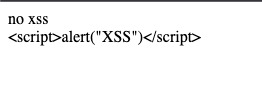

[](./blob/develop/LICENSE) [](https://www.npmjs.com/package/@joyned/html-fairy) [](https://bundlephobia.com/package/@joyned/html-fairy)

[](./actions/workflows/linter.yml) [](./actions/workflows/deploy.yml)

# html-fairy
A simple, tiny, and XSS-protected tool for creating HTML structures from strings and arguments.

## Installation
``` js
npm install @joyned/html-fairy
```

## Usage
``` js
import htmlFairy from "@joyned/html-fairy";

const element = htmlFairy`<div data-attribute="value">Content</div>`;
```

Any argument that is an HTML element will be included in the resulting structure in the same position as the corresponding placeholder in the template string. Non-element arguments will be converted to HTML-escaped strings and included in the resulting structure.

``` js
import htmlFairy from "@joyned/html-fairy";

const value = 'foo';
const element = htmlFairy`<div data-attribute="${value}">Content</div>`;
```
Arrays of elements can also be passed as arguments, and the resulting structure will include all the elements from the array in the correct nested position.

``` js
import htmlFairy from "@joyned/html-fairy";

const list = ['a', 'b', 'c'].map((x) => htmlFairy`<li>${x}</li>`);
const element = htmlFairy`<ul>${list}</ul>`;
```
It's prevent XSS by default.

``` js
import htmlFairy from "@joyned/html-fairy";

const evilUserInput = '<script>alert("XSS")</script>';
const someElement = htmlFairy`<div>no xss</div>`;
const element = htmlFairy`<div>${someElement}${evilUserInput}</div>`;
```



## License
html-fairy is released under the MIT License. See the [LICENSE](./LICENSE) file for details.


